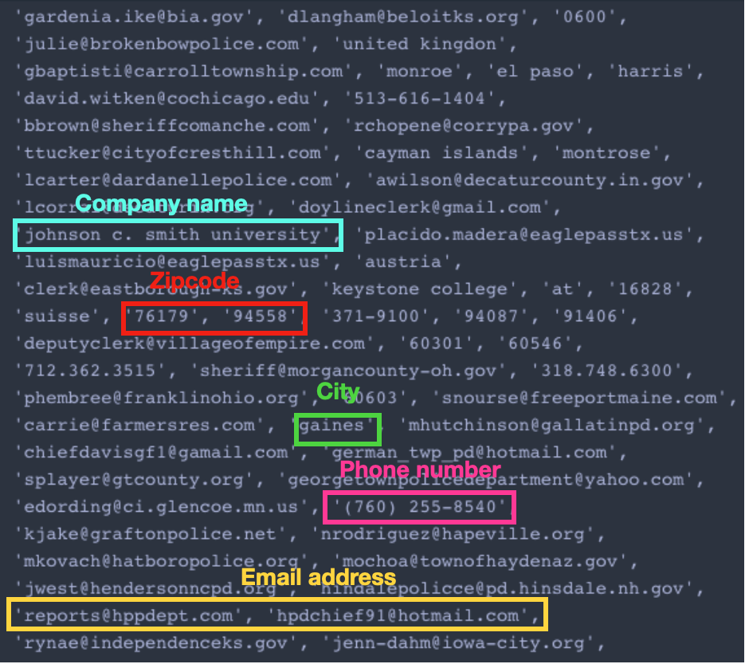
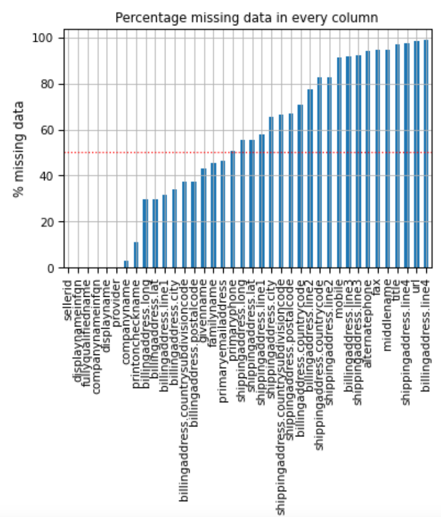

As we data scientists know, the quality of the data can make or break a data product. Poor quality data has led to a loss of ~600B US dollars just in the field of marketing alone [1]. Another report cites duplicate data as the mother of all data quality problems [2]. Duplicate data issues are faced by many companies,  who has their data collected from different CRM platforms and accounting systems as the data in these platforms come in different formats. Duplicate records when not removed can negatively affect data products. For example, customer segmentation analysis can report the same customer segmented into multiple tiers when the duplicate records are not removed. The goal of Super De-Duper project is to identify duplicates records and provide a “Dupe” score, a custom metric that quantifies the duplicity of the records. 

I consulted with a startup company in Boston, Tally Street, who provide virtual accountant services to B2B companies and worked on their customer profile data to remove duplicates. The main features of the data that I used for this project are: name of the company, their address and primary phone number. There are several duplicates in the dataset, one example is shown below:

| Full name      | Company name | Address line1 | Address line 2 | City | State | Zipcode | Phone number |
| ----------- | ----------- | ----------- | ----------- | ----------- | ----------- | ----------- | ----------- |
| Curtis Corrado Insurance Agency (deleted) | Curtis Corrado Insurance Agency | 5975 S Quebec St. | Suite 209 | Centennial | CO | 80111 | (303) 220-7688 |
| Curtis Corrado Insurance Agency | Farmers Insurance-Curt Corrado Agency | 5975 S Quebec St | #209 | Centennial | CO | 80111 | 3032207688 |

Just by looking at these records, we can say that the second record is a duplicate of the first, but this is not an easy task for computer. So, the goal here is to create an algorithm to identify duplicates.

## Data Challenges:

With an end goal of identifying duplicates, there are two main challenges I faced in this dataset. They are (a) very messy data and (b) >50% missing data. 

### Messy data 
The data, particularly in the address fields such as city, state and country is very messy. For example, a snapshot of the unique value observed in the billing address feature “country” is shown below: 

 

For a feature named country, we would expect the feature to contain name of the countries, for example - USA, Mexico. But, this feature, in addition to the country name, also contains other metadata such as city name, company name, phone number, email address, so on. It should be noted that even though we have separate fields for them, the data is pretty much jumbled around all the fields. 

### >50% missing data
The second challenge to attain our end goal of finding duplicates is - missing data. More than 50% of the data is missing in this data set. Even after data cleaning (will be explained later), only 42% of the data has non-missing values in all features. 

## Approach:

Considering the diverse nature of data in the three main features (name, address and phone number) together with data challenges mentioned above, I decided to create three different pipelines for each of these features to overcome these challenges. They are as follows:

### 1. Data pipeline for company name: 
	
The company profile dataframe contained three features for the name of the company: display name, fully qualified name and company name. 

	Python code here to show display name is redundant

From analysis it was clear that the feature 'display name' is a redudant feature, and thus, it was removed. The other two name features are retained as they provide varied information. After feature selection, the data is converted into vector using TF-IDF vectorization with character embedding. There are duplicates in the dataset because of spelling error, that I chose to perform character embedding. Also, lot of companies has ‘ltd’ and ‘Co’ at the end and TF-IDF gives less importance to that. 
	
Finally to find duplicate names in the dataset, cosine similarity is chosen. Note that the char embedding resulted in 300K+ features, where Euclidean distance will fail. 

### 2. Data pipeline for Billing address features:

As shown before, there are 10 features available under billing address, but the data present in these fields are very messy (all jumbled across features). To overcome this challenge, I decided to clean all the columns and combine them into one feature and convert it into geocordinates. 

	Data cleaning:
		- Removing punctuations
		- Removing company names
		- Removing people names
		- Removing emails address
		- Removing phone/fax numbers
After data cleaning and combining all columns, the address becomes

Now, the cleaned address is converted into geo co-ordinates (latitude and longitude). For this, I utilized geopy together with bing maps. So, the address now becomes

	
Show schematic of address as is, then clean address, then geo-coordinates

Finally, Haversine distance was used to calculate the distance between two geo-coordinates in miles and cut off of 1 mile was used. If the distance calculates is less than 1 mile, address is a match. 

### 3. Data pipeline for phone numbers

Data was cleaned to convert all phone number into one format. The extensions are also removed from the phone number and the phone numbers were compared directly with each other. Here the metric was set to 1 whenever the phone number matches and 0 when it is not. 

## Defining the custom metric, Dupe score:

The three data pipeline for the features - company names, address and phone number creates 3 metrics. All these three metrics are combined together in one metric called Dupe score. This dupe score ranges from 0 to 1 and quantifies whether a record is duplicate or not. The dupe score is calculated as follows:

Case (1): Weighted average of name, address and phone number
Case (2): Weighted average of name and phone number
Case (3): Weighted average of name and address
Case (4): Names score

Because the data has >50% missing, one dupe score ideation is not possible, and has o be customized for records with varying missing features. 

## Evaluation

Evaluating a model or performance is very crucial, particularly for unsupervised setting like this situation. To check the performance, I created a validation dataset by randomly sampling 100 records from the data and introducing different types of duplicates to them as below:

Exact duplicate
Duplicates with spelling error
Duplicates with reversed word order of the name

Altogether, I generated about 800 duplicate records and combined together with the original dataset and ran the model on this data. The model was run at different cut-off of Dupe score - 0.6 - 1 at a frequency of 0.5. The resulting precision-recall curve is shown below:

At a 0.7 Dupe cut off score, F1-score of 0.96 was obtained, which is pretty descent. 

Now looking at the same example after running through the model, the model identified the duplicate with a Dupe score of 0.8. The model also provides scores for the three main features, which provides interpretability of the score. 

## References:

1. 
2. https://dzone.com/articles/dirty-disparate-duplicated-data-how-to-stop-the-3

